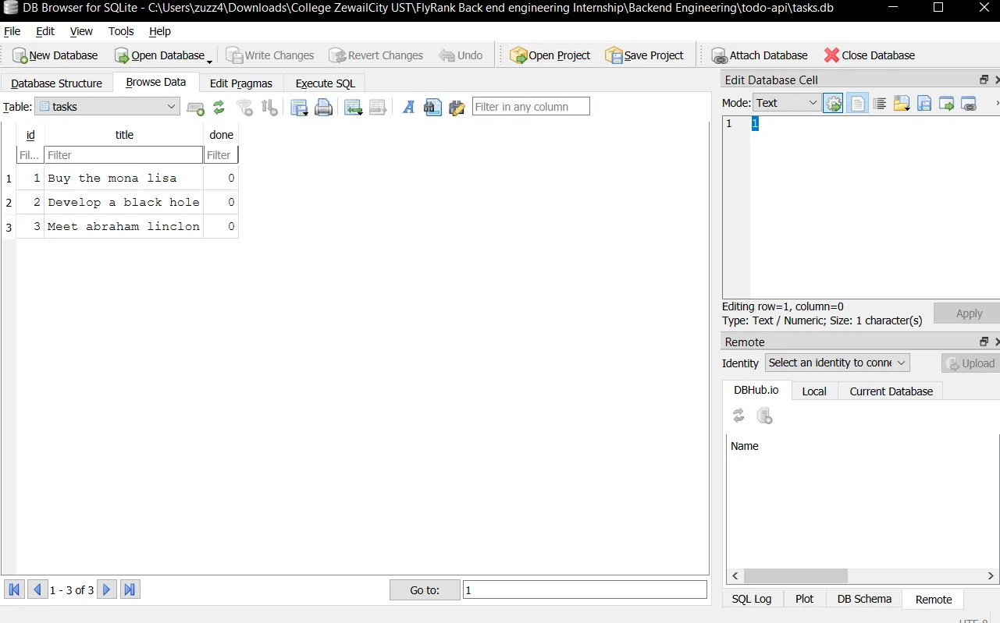

# Task API

A lightweight CRUD API for managing a to-do list. It is built with Express and stores task data in a SQLite database, making it a simple project for learning or experimenting with CRUD endpoints and persistence.

## Features

- Create, Read, Update, Delete tasks (CRUD)
- JSON request and response bodies
- Input validation for task titles
- Health-check endpoint
- Interactive Swagger UI documentation
- Persistent storage with SQLite — data survives server restarts

## Tech stack

- [Node.js](https://nodejs.org/)
- [Express](https://expressjs.com/) 5
- [SQLite](https://www.sqlite.org/) via Node's built-in [`node:sqlite`](https://nodejs.org/api/sqlite.html) module
- [Swagger UI Express](https://github.com/scottie1984/swagger-ui-express)
- [OpenAPI](https://www.openapis.org/) 3.0
- [Nodemon](https://nodemon.io/) for development

## Getting started

### Prerequisites

- Node.js 22.5 or newer (required for the built-in `node:sqlite` module)
- npm

### Installation

Clone the repository, move into the project directory, and install the dependencies:

```bash
git clone <repository-url>
cd todo-api
npm install
```

### Start the server

Run the development server with Nodemon:

```bash
npm run dev
```

The API is available at:

```text
http://localhost:3000
```

> The server currently listens on port `3000`.

## API reference

| Method | Endpoint | Description |
| --- | --- | --- |
| `GET` | `/` | Returns basic API information |
| `GET` | `/health` | Checks whether the server is running |
| `GET` | `/tasks` | Returns all tasks |
| `POST` | `/tasks` | Creates a task |
| `GET` | `/tasks/:id` | Returns one task by ID |
| `PUT` | `/tasks/:id` | Updates a task's title and/or completion status |
| `DELETE` | `/tasks/:id` | Deletes a task |

All task endpoints use JSON. A task has the following shape:

```json
{
  "id": 1,
  "title": "Buy groceries",
  "done": false
}
```

### Create a task

A non-empty `title` is required. New tasks start with `done: false`.

```bash
curl -X POST http://localhost:3000/tasks \
  -H "Content-Type: application/json" \
  -d '{"title":"Read a book"}'
```

### List tasks

```bash
curl http://localhost:3000/tasks
```

### Get a task

```bash
curl http://localhost:3000/tasks/1
```

### Update a task

Send either `title`, `done`, or both fields:

```bash
curl -X PUT http://localhost:3000/tasks/1 \
  -H "Content-Type: application/json" \
  -d '{"done":true}'
```

### Delete a task

```bash
curl -X DELETE http://localhost:3000/tasks/1
```

A successful delete returns `204 No Content`.

## Responses and errors

- `200 OK` — request completed successfully
- `201 Created` — task created successfully
- `204 No Content` — task deleted successfully
- `400 Bad Request` — title is missing or empty
- `404 Not Found` — task ID does not exist

Errors are returned as JSON, for example:

```json
{
  "error": "Task 99 not found"
}
```

## Interactive documentation

Start the server and visit [http://localhost:3000/docs](http://localhost:3000/docs) to explore and try the API through Swagger UI. The source OpenAPI specification is available in [`openapi.json`](./openapi.json).

## Project structure

```text
.
├── index.js        # Express server and route handlers
├── db.js           # SQLite connection, schema, and seed logic
├── tasks.db        # SQLite database file (git-ignored, created automatically)
├── openapi.json    # OpenAPI 3.0 specification
├── package.json    # Project metadata, scripts, and dependencies
├── package-lock.json
├── .gitignore
└── README.md
```

## Data persistence

Tasks are stored in a SQLite database (`tasks.db`) instead of in memory, so data survives a server restart.

**Why SQLite:** it's a single file with no separate server process to install or configure, which makes it a good fit for a small project like this — `tasks.db` is created automatically the first time the app runs.

**Where the database lives:** `tasks.db`, in the project root. It's git-ignored, so cloning this repo does not come with any existing data — each clone starts fresh and the database, table, and seed tasks are all created automatically on first run.

**Start command:**

```bash
npm run dev
```

This alone is enough to get a working app: `tasks.db` and its `tasks` table are created if missing, and seeded with three example tasks the first time the table is empty.

The default seed tasks are:

- Buy the mona lisa
- Develop a black hole
- Meet abraham linclon

### Inspecting the database directly

`tasks.db` can be opened in [DB Browser for SQLite](https://sqlitebrowser.org/) to view and query the data outside the API:



Example query run directly against the database in DB Browser:

```sql
SELECT * FROM tasks WHERE done = 1;
```

This returned only the tasks currently marked complete — confirming that the API and DB Browser read and write the exact same file, with no syncing step between them.

## License

This project is licensed under the ISC License.
