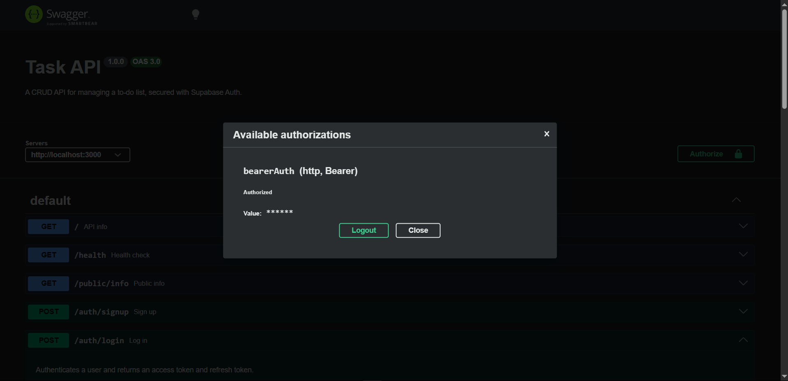
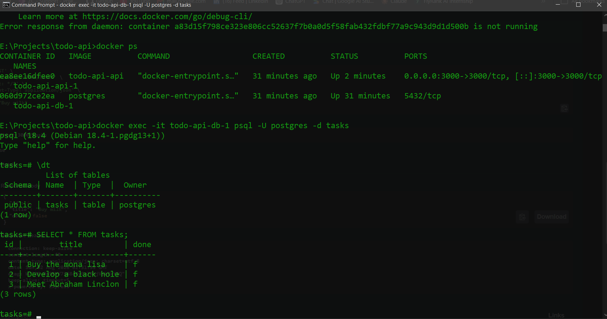

# Task API

A CRUD API for managing a to-do list, secured with Supabase Auth. Built with Express, backed by PostgreSQL running in Docker, and started with a single command via Docker Compose.

This project has grown across several assignments:

- **A1** — in-memory storage
- **A2** — SQLite file storage
- **A3** — containerized Postgres, Docker Compose
- **A4** (this version) — authentication with Supabase: sign up, log in, log out, and bearer-token-protected routes

The original task CRUD routes and behavior are unchanged from A3 — this version adds a separate auth layer (sign up / log in / log out) and two example routes demonstrating public vs. protected access.

## Features

- Create, Read, Update, Delete tasks (CRUD)
- User authentication via [Supabase Auth](https://supabase.com/auth) — sign up, log in, log out
- JWT-based route protection with reusable auth middleware
- Public and protected example routes
- JSON request and response bodies
- Input validation for task titles and auth credentials
- Health-check endpoint
- Interactive Swagger UI documentation with bearer-token "Authorize" support
- Persistent storage with PostgreSQL, running in a Docker container with a named volume — data survives both app restarts and full container teardown
- Entire stack (app + database) starts with one command: `docker compose up`

## Tech stack

- [Node.js](https://nodejs.org/) 20
- [Express](https://expressjs.com/)
- [PostgreSQL](https://www.postgresql.org/), via [node-postgres (`pg`)](https://node-postgres.com/)
- [Supabase Auth](https://supabase.com/auth), via [`@supabase/supabase-js`](https://github.com/supabase/supabase-js)
- [Docker](https://www.docker.com/) & [Docker Compose](https://docs.docker.com/compose/)
- [Swagger UI Express](https://github.com/scottie1984/swagger-ui-express)
- [OpenAPI](https://www.openapis.org/) 3.0

## Getting started

### Prerequisites

- [Docker Desktop](https://www.docker.com/products/docker-desktop/) (with WSL2 backend, on Windows)
- Git
- A free [Supabase](https://supabase.com/) account and project

No local Node.js or Postgres install is required — both run inside containers.

### Installation

Clone the repository and move into the project directory:

```bash
git clone <repository-url>
cd todo-api
```

Copy the example environment file and fill in your own Supabase values:

```bash
cp .env.example .env
```

In your [Supabase Dashboard](https://supabase.com/dashboard), go to **Project Settings → API** and copy your **Project URL** and **anon key** into `.env`. Never use the `service_role` key here — it bypasses all security.

One-time Supabase setting for local testing: go to **Authentication → Sign In / Providers → Email** and turn **"Confirm email" off**, so a freshly signed-up test account can log in immediately without clicking an email confirmation link.

### Start the whole stack

```bash
docker compose up
```

This single command builds the app image, pulls the official Postgres image, and starts both containers together. The API becomes available at:

```text
http://localhost:3000
```

To stop everything:

```bash
docker compose down
```

Data persists across `docker compose down` / `docker compose up` cycles because Postgres's data directory is mounted to a named Docker volume (`taskdata`), not stored inside the container itself.

## Environment variables

Set in `.env` (git-ignored; see `.env.example` for the required keys):

| Variable | Description |
| --- | --- |
| `DATABASE_URL` | Postgres connection string. When running via `docker compose`, the app reaches the database container by its service name (`db`), not `localhost`. |
| `SUPABASE_URL` | Your Supabase project's URL, from Project Settings → API. |
| `SUPABASE_KEY` | Your Supabase project's `anon` (public) key. Never use the `service_role` key. |
| `PORT` | Port the server listens on (defaults to `3000`). |

## API reference

| Method | Endpoint | Auth required | Description |
| --- | --- | --- | --- |
| `GET` | `/` | No | Returns basic API information |
| `GET` | `/health` | No | Checks whether the server is running |
| `POST` | `/auth/signup` | No | Creates a new user account |
| `POST` | `/auth/login` | No | Authenticates a user, returns an access token and refresh token |
| `POST` | `/auth/logout` | Yes | Ends the current user's session |
| `GET` | `/public/info` | No | Returns a public welcome message |
| `GET` | `/protected/profile` | Yes | Returns the authenticated user's id, email, and account creation date |
| `GET` | `/protected/dashboard` | Yes | Returns a personalized welcome message |
| `GET` | `/tasks` | No | Returns all tasks |
| `POST` | `/tasks` | No | Creates a task |
| `GET` | `/tasks/:id` | No | Returns one task by ID |
| `PUT` | `/tasks/:id` | No | Updates a task's title and/or completion status |
| `DELETE` | `/tasks/:id` | No | Deletes a task |

Protected routes require an `Authorization: Bearer <access_token>` header, using the token returned from `/auth/login`.

## Authentication

Authentication is handled by [Supabase Auth](https://supabase.com/auth) — this server never stores or hashes a password itself. Signup and login requests are forwarded to Supabase, which returns a signed [JSON Web Token](https://jwt.io/introduction) (the access token) on successful login.

Protected routes verify that token by calling Supabase's `getUser()` on every request — this is a real network check, not just decoding the token locally, so a tampered or expired token is always rejected.

### Sign up

```bash
curl -X POST http://localhost:3000/auth/signup \
  -H "Content-Type: application/json" \
  -d '{"email":"you@example.com","password":"yourpassword"}'
```

Returns `201` with the created user object, or `400` if email/password is missing or invalid.

### Log in

```bash
curl -X POST http://localhost:3000/auth/login \
  -H "Content-Type: application/json" \
  -d '{"email":"you@example.com","password":"yourpassword"}'
```

Returns `200` with `access_token` and `refresh_token`, or `401` with `{"error":"Invalid login credentials"}` if the credentials are wrong.

### Log out

```bash
curl -X POST http://localhost:3000/auth/logout \
  -H "Authorization: Bearer <access_token>"
```

Returns `204 No Content` on success.

### Access a protected route

```bash
curl http://localhost:3000/protected/profile \
  -H "Authorization: Bearer <access_token>"
```

Returns `200` with the user's `id`, `email`, and `created_at` if the token is valid, or `401` if the header is missing, malformed, or the token is invalid/expired.

## Task endpoints

All task endpoints use JSON. A task has the following shape:

```json
{
  "id": 1,
  "title": "Buy groceries",
  "done": false
}
```

### Create a task

A non-empty `title` is required. New tasks start with `done: false`.

```bash
curl -X POST http://localhost:3000/tasks \
  -H "Content-Type: application/json" \
  -d '{"title":"Read a book"}'
```

### List tasks

```bash
curl http://localhost:3000/tasks
```

### Get a task

```bash
curl http://localhost:3000/tasks/1
```

### Update a task

Send either `title`, `done`, or both fields:

```bash
curl -X PUT http://localhost:3000/tasks/1 \
  -H "Content-Type: application/json" \
  -d '{"done":true}'
```

### Delete a task

```bash
curl -X DELETE http://localhost:3000/tasks/1
```

A successful delete returns `204 No Content`.

### Example request/response

```text
<< PASTE ONE curl -i OUTPUT HERE — e.g. curl -i -X POST http://localhost:3000/auth/signup -H "Content-Type: application/json" -d '{"email":"...","password":"..."}' >>
```

## Responses and errors

- `200 OK` — request completed successfully
- `201 Created` — resource created successfully
- `204 No Content` — request completed successfully, nothing to return
- `400 Bad Request` — missing or invalid input
- `401 Unauthorized` — missing, malformed, or invalid/expired auth token, or bad login credentials
- `404 Not Found` — task ID does not exist

Errors are returned as JSON, for example:

```json
{
  "error": "Task 99 not found"
}
```

## Interactive documentation

Start the stack and visit [http://localhost:3000/docs](http://localhost:3000/docs) to explore and try the API through Swagger UI. Protected routes are marked with a lock icon — click **Authorize** at the top of the page, paste an access token (no `Bearer` prefix needed), and use **Try it out** on any route without manually setting headers.



The source OpenAPI specification is available in [`openapi.json`](./openapi.json).

## Project structure

```text
.
├── index.js            # Express server and route handlers (tasks + auth)
├── db.js               # Postgres connection (pg Pool), schema, and seed logic
├── supabase.js         # Supabase client initialization
├── Dockerfile           # Builds the app's container image
├── compose.yaml          # Defines and wires the api + db services together
├── openapi.json         # OpenAPI 3.0 specification, incl. bearer auth scheme
├── package.json         # Project metadata, scripts, and dependencies
├── package-lock.json
├── .env                  # Local secrets (git-ignored, not committed)
├── .env.example          # Placeholder env keys (committed)
├── .gitignore
├── tasks.db              # SQLite file from an earlier assignment stage (A2), unused by the current app
└── README.md
```

## Data persistence

Tasks are stored in PostgreSQL, running as its own containerized server (not a local file). The database's actual data directory is mounted to a named Docker volume (`taskdata`), which lives outside any individual container — so removing or recreating the `db` container does not delete the data.

**Connection:** the app reads `DATABASE_URL` from `.env` on startup and connects via the [`pg`](https://node-postgres.com/) driver. When run through `docker compose`, this URL points at the `db` service by name (containers on the same Compose network resolve each other by service name, not `localhost`).

**Table & seeding:** on startup, the app creates the `tasks` table if it doesn't already exist, then seeds three example tasks — but only if the table is currently empty.

The default seed tasks are:

- Buy the mona lisa
- Develop a black hole
- Meet Abraham Lincoln

**Persistence was verified by:** creating tasks via the API, running `docker compose down` to fully tear down both containers, then `docker compose up` again — the previously created tasks were still present, confirming the volume (not the container) is what holds the data.

User accounts, by contrast, are stored entirely by Supabase, not in this project's own database — deleting or resetting the local Postgres volume has no effect on user accounts.

### Inspecting the database directly

Since data lives in Postgres rather than a SQLite file, [DB Browser for SQLite](https://sqlitebrowser.org/) can no longer be used to inspect it. Instead, open a `psql` prompt inside the running database container:

```bash
docker exec -it todo-api-db-1 psql -U postgres -d tasks
```

```sql
\dt
SELECT * FROM tasks;
```



## License

This project is licensed under the ISC License.
